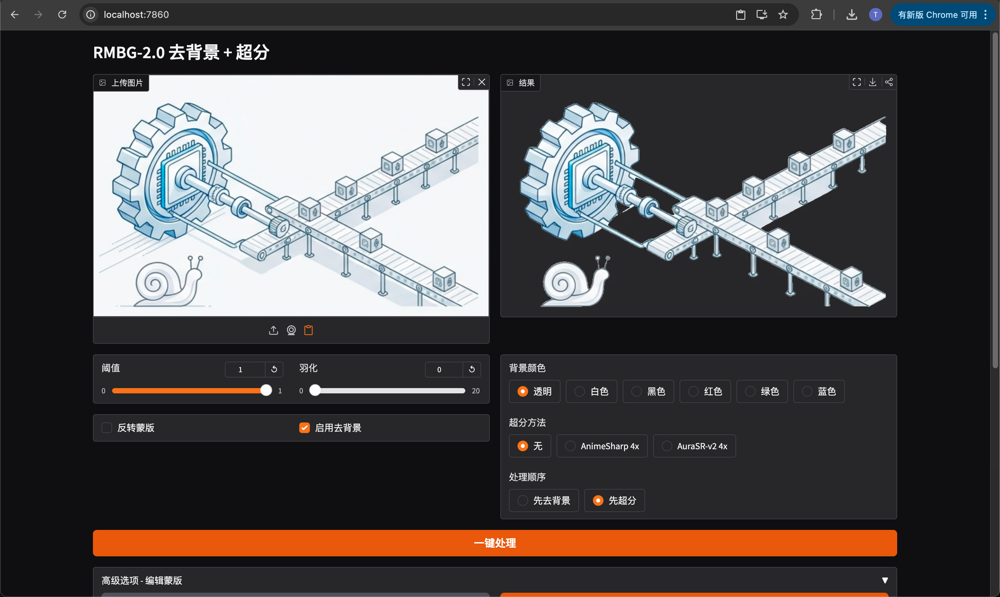
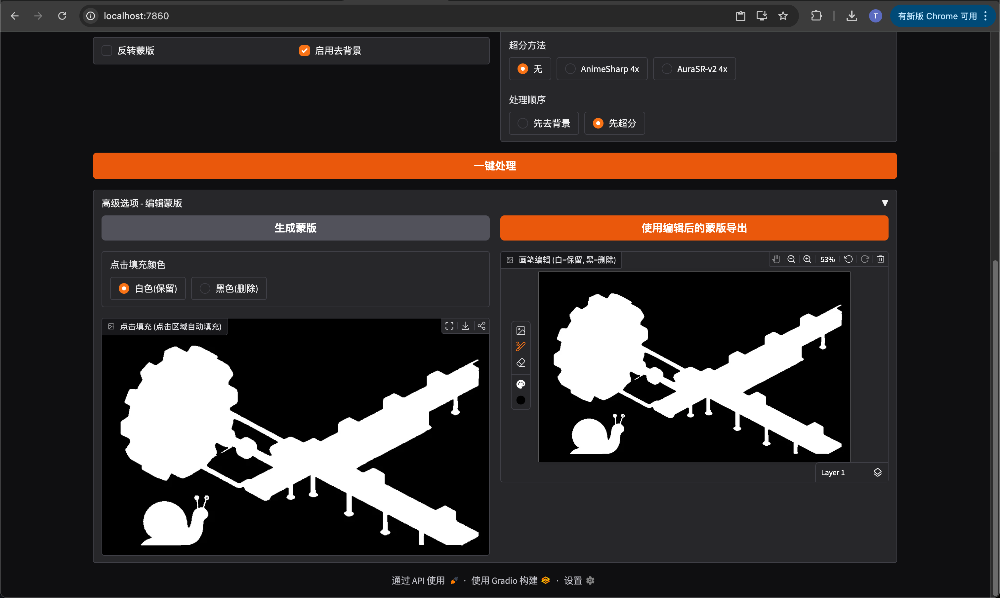

# RMBG-2.0 去背景 + 超分

一个基于 Web 的图片处理工具，集成了 AI 去背景和 4x 超分辨率功能。

## 效果展示

| 界面 | 处理结果 |
|:---:|:---:|
|  |  |

## 功能特性

- **AI 去背景**：使用 [RMBG-2.0](https://huggingface.co/briaai/RMBG-2.0) 模型自动去除图片背景
- **4x 超分辨率**：支持两种超分模型
  - [4x-AnimeSharp](https://openmodeldb.info/models/4x-AnimeSharp) - 适合动漫/插画风格
  - [AuraSR-v2](https://huggingface.co/fal/AuraSR-v2) - 通用超分模型
- **蒙版编辑**：支持手动修正去背景区域
  - 点击填充：点击区域自动 flood fill
  - 画笔编辑：精细涂抹修正
- **灵活配置**：可选择处理顺序（先去背景/先超分）、背景颜色等

## 部署

### 环境要求

- Python 3.10+
- CUDA（推荐，CPU 也可运行但较慢）

### 安装步骤

```bash
# 克隆项目
git clone <repo-url>
cd RMBG-2.0

# 创建虚拟环境并安装依赖
uv venv rmbg --python 3.10
source rmbg/bin/activate
uv pip install torch torchvision --index-url https://download.pytorch.org/whl/cu118
uv pip install gradio transformers spandrel aura-sr pillow numpy

# 下载 4x-AnimeSharp 模型
mkdir -p weights
wget https://huggingface.co/Kim2091/AnimeSharp/resolve/main/4x-AnimeSharp.pth -O weights/4x-AnimeSharp.pth
```

### 启动

```bash
source rmbg/bin/activate
python app.py
```

访问 http://localhost:7860 即可使用。

开发模式（热重载）：
```bash
gradio app.py
```

## 使用说明

1. 上传图片
2. 选择超分方法和背景颜色
3. 点击"一键处理"

如需手动修正蒙版，展开"高级选项"：
1. 点击"生成蒙版"
2. 在点击填充或画笔编辑窗口修正
3. 点击"使用编辑后的蒙版导出"

## 致谢

- [RMBG-2.0](https://huggingface.co/briaai/RMBG-2.0) - BRIA AI
- [4x-AnimeSharp](https://openmodeldb.info/models/4x-AnimeSharp) - Kim2091
- [AuraSR-v2](https://huggingface.co/fal/AuraSR-v2) - fal.ai
- [Spandrel](https://github.com/chaiNNer-org/spandrel) - 模型加载库
- [Claude](https://www.anthropic.com/claude) & [Kiro](https://kiro.dev) - AI 编程助手

## License

MIT
